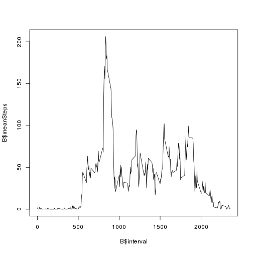
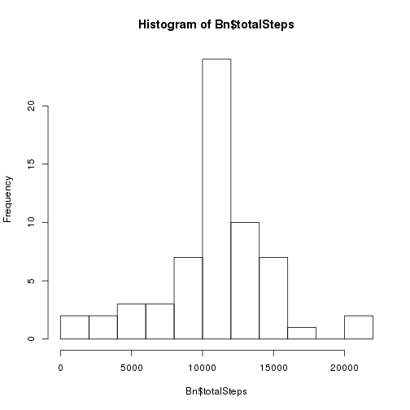

# Reproducible Research: Peer Assessment 1
## Data

The data for this assignment can be downloaded from the course web site:

*    Dataset: Activity monitoring data [52K]

The variables included in this dataset are:

*    steps: Number of steps taking in a 5-minute interval (missing values are coded as NA)

*    date: The date on which the measurement was taken in YYYY-MM-DD format

*    interval: Identifier for the 5-minute interval in which measurement was taken

The dataset is stored in a comma-separated-value (CSV) file and there are a total of 17,568 observations in this dataset.


## Loading and preprocessing the data

After downloading the data from the website, set the work directory to this file and the data file with the command

    setwd('path/to/your/files')
    library(knitr)

then load and process the data into a format suitable for your analysis

```r
T <- read.csv('activity.csv')
```


## What is mean total number of steps taken per day?

Ignoring the missing values in the dataset, calculate the total number of steps taken per day


```r
Tna <- na.exclude(T)
B   <- aggregate( Tna$steps, by=list(date=Tna$date), sum)
colnames(B)[2] <- 'totalSteps'
```

*     Make a histogram of the total number of steps taken each day


```r
hist(B$totalSteps,breaks=12)
```

 

*    The mean of the total number of steps taken per day is

```r
mean(B$totalSteps)
```

```
## [1] 10766.19
```

*    and the median is

```r
median(B$totalSteps)
```

```
## [1] 10765
```


## What is the average daily activity pattern?

*    Make a time series plot (i.e. type = "l") of the 5-minute interval (x-axis) and the average number of steps taken, averaged across all days (y-axis)

```r
B   <- aggregate( Tna$steps, by=list(interval=Tna$interval), mean)
colnames(B)[2] <- 'meanSteps'
plot(B$interval,B$meanSteps,type='l')
```

 

*   On average across all the days in the dataset, the maximum number of steps is

```r
max(B$meanSteps)
```

```
## [1] 206.1698
```
and it happens at the interval

```r
B[which.max(B$meanSteps),1]
```

```
## [1] 835
```


## Imputing missing values

Note that there are a number of days/intervals where there are missing values (coded as NA). The presence of missing days may introduce bias into some calculations or summaries of the data.

*    The total number of missing values in the dataset (i.e. the total number of rows with NAs) is


```r
sum( is.na(T$steps) )
```

```
## [1] 2304
```
which corresponds to the percentage 

```r
sum( is.na(T$steps) )/nrow(T) * 100
```

```
## [1] 13.11475
```


*    Devise a strategy for filling in all of the missing values in the dataset. The strategy does not need to be  sophisticated. For example, you could use the mean/median for that day, or the mean for that 5-minute interval, etc.

```r
iT<-is.na(T$steps)      # index of NA in table T
iB=match(T[iT,3],B[,1]) # index in B that match interval
```

*   Create a new dataset that is equal to the original dataset but with the missing data filled in.

```r
N<-T              # new dataset
N[iT,1]=B[iB,2]   # updates steps with mean for that 5 minute interval 
```


*   Make a histogram of the total number of steps taken each day and Calculate and report the mean and median total  number of steps taken per day. Do these values differ from the estimates from the first part of the assignment? What is the impact of imputing missing data on the estimates of the total daily number of steps?


```r
Bn   <- aggregate( N$steps, by=list(date=N$date), sum)
colnames(Bn)[2] <- 'totalSteps'
```

*     Make a histogram of the total number of steps taken each day


```r
hist(Bn$totalSteps,breaks=12)
```

 

*    The mean and the median for the new data are

```r
mean(Bn$totalSteps)
```

```
## [1] 10766.19
```

```r
median(Bn$totalSteps)
```

```
## [1] 10766.19
```

Our strategy to fill in the NA values did not change the mean and increase just a lit bit the median making it equals to the mean.


## Are there differences in activity patterns between weekdays and weekends?

For this part the weekdays() function may be of some help here. Use the dataset with the filled-in missing values for this part.

*    Create a new factor variable in the dataset with two levels – “weekday” and “weekend” indicating whether a given  date is a weekday or weekend day.

```r
WD<-weekdays(as.POSIXct(N$date,'%Y-%M-%D'))
N$weekend<-(WD=='Saturday')|(WD=='Sunday')
```

*    Make a panel plot containing a time series plot (i.e. type = "l") of the 5-minute interval (x-axis) and the average  number of steps taken, averaged across all weekday days or weekend days (y-axis). 

```r
library(lattice)
NN <- transform(N, weekend =factor(weekend))

NT <- subset( N,N$weekend==TRUE)
NF <- subset( N,N$weekend==FALSE)
BT <- aggregate( NT$steps,by=list(interval=NT$interval),mean)
BF <- aggregate( NF$steps,by=list(interval=NF$interval),mean)
B <- rbind(BT,BF)
B[1:288,3]='weekend'
B[289:576,3]='weekday'
xyplot( B$x ~ B$interval | B$V3 ,type= 'l')
```

 
